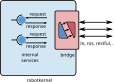

.. _robotkernel_service_bridge:

Bridge
======

A **service bridge** is a dynamically loadable shared library that 
provides a standardized interface between the robotkernel runtime and 
external communication or middleware layers.

It enables seamless exposure of internal robotkernel services to external 
tools, applications, or protocols — without modifying the core system.

   **Figure:** Service bridge architecture — translates internal robotkernel services to external interfaces.

**Key characteristics:**

- Provided as a dynamically loadable shared object (e.g., `.so` file).
- Exposes a minimal C interface to the robotkernel runtime.
- Translates internal robotkernel services into formats usable by external middleware (e.g., JSON, CLI, ROS, etc.).
- Reusable bridges are already available for common use cases.

.. note::
   Once loaded into the robotkernel, **all internal services are automatically exported** via the bridge.

.. _robotkernel_service_bridge_benefits:

Benefits
________

**Common Service Bridges:**

- **Links & Nodes (LN-Services)**  
  Enables integration with the Links-and-Nodes framework for distributed system coordination.

- **Command-Line Interface (CLI)**  
  Provides direct command-line access to robotkernel services for debugging and scripting.

- **RESTful API**  
  Offers HTTP/JSON-based access to services — ideal for web tools, monitoring, and remote control.

- **Custom Bridges**  
  Developers can easily implement their own bridges for specific middleware (e.g., ROS2, MQTT, gRPC).

**Typical use cases:**

- **No core modification required** — communication layers can be added, replaced, or extended without touching the robotkernel core.
- **Clean separation** between real-time control logic and external interfaces.
- **Consistent access** to robotkernel services across different tools and applications.
- **Reusability** — the same control stack can be used with different middleware backends.
- **Reduced integration effort** — simplifies development of custom monitoring, visualization, or control tools.

.. note::
   **Design Principle**: Service bridges enable a modular, extensible architecture where communication is decoupled from control logic.

.. _robotkernel_service_bridge_development:

Writing Custom Service Bridges
______________________________

Creating a new service bridge is straightforward and follows a well-defined pattern.

**Minimal C interface required**::

  // Entry point: called when the bridge is loaded
  int rk_bridge_init(void);

  // Optional: cleanup function
  void rk_bridge_cleanup(void);

  // Optional: expose additional service metadata
  const char* rk_bridge_get_name(void);

The bridge must be compiled as a shared library (.so) and placed in the robotkernel module search path.
Key steps:

    Implement the bridge logic (e.g., JSON serialization, CLI parsing).
    Export the required C functions.
    Compile as shared object (e.g., gcc -shared -fPIC -o libmy_bridge.so bridge.c).
    Load via robotkernel configuration (e.g., in YAML).

Example YAML configuration::

  bridge:
    name: my_rest_bridge
    so_file: libmy_bridge.so
    config:
      port: 8080
      host: 0.0.0.0

For more details, see the robotkernel bridge development guide at: https://rmc-github.robotic.dlr.de/robotkernel

.. _robotkernel_service_bridge_summary:

Summary
_______

    Service bridges provide a plug-and-play way to expose robotkernel services externally.
    They support multiple communication layers (CLI, REST, ROS, etc.) without core changes.
    Enable modular, maintainable, and scalable integration with external tools.
    Promote reusability and interoperability across different systems and workflows.

For a full list of available bridges and development resources, visit: https://rmc-github.robotic.dlr.de/robotkernel <https://rmc-github.robotic.dlr.de/robotkernel>_
