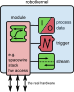
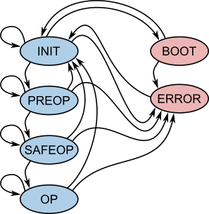
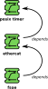
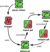

.. _robotkernel_module_concept:

Module
======

Concept and Purpose
___________________

The **module** is a fundamental building block in the robotkernel system. It implements the robotkernel state machine and provides core devices such as:

- Process data (PD)
- Trigger devices
- Stream devices

   **Figure:** Module architecture in robotkernel.

Typical use cases include:

- Implementing device drivers
- Processing routines working on shared process data
- Synchronizing execution via trigger devices
- Abstracting I/O access through stream devices
- Combining multiple modules into complex control structures

.. note::
   Modules are dynamically loaded and managed by the robotkernel runtime. They are configured via YAML files and integrate seamlessly with the state machine and dependency tracking system.

.. _robotkernel_module_state_machine:

State Machine
_____________

The robotkernel module state machine is inspired by industry-standard fieldbus protocols (e.g., EtherCAT), featuring built-in dependency tracking to ensure coordinated state transitions.

The state machine defines the lifecycle of all modules with six distinct states:

- **INIT**  
  Initialize internal data structures and allocate resources. Communication interfaces are inactive.

- **PREOP**  
  Establish communication channels, configure attached devices, and verify connectivity before enabling cyclic data exchange.

- **SAFEOP**  
  Enter cyclic operation in read-only mode. Validate data integrity and timing without modifying process data.

- **OP**  
  Full operational mode. Enable read and write access to process data and active participation in real-time control loops.

- **ERROR**  
  Entered upon detecting a fault. Suspends cyclic activity for safe recovery; requires reset or reinitialization.

- **BOOT**  
  Maintenance state used for firmware updates or diagnostics. Normal operation and triggers are disabled.

   **Figure:** Fieldbus-inspired state machine with dependency tracking.

.. note::
   - Dependency tracking ensures that when a module transitions to a higher state, all dependent modules are automatically promoted to the minimum required state.
   - The dedicated **ERROR** and **BOOT** states support robust fault handling and maintenance workflows.

.. _robotkernel_module_examples:

Examples
________

The robotkernel ecosystem includes a wide range of pre-built modules. Here are some key examples:

- **``module_posix_timer``**  
  Provides a deterministic cyclic trigger source (e.g., 1 kHz), used as a base timing reference.

- **``module_ethercat``**  
  Implements an EtherCAT master, configuring and managing fieldbus slaves.

- **``module_spacewire``**  
  Enables communication with SpaceWire networks (e.g., David, Miro, etc.).

- **``module_fsoe``**  
  Implements the FSoE (Functional Safety over EtherCAT) protocol, operating transparently on process data devices.

- **``module_tty``**  
  Manages Linux TTY interfaces and exposes stream devices for data consumption.

- **``module_serial_fts``**  
  Implements the DLR FTS serial communication protocol on stream devices.

The robotkernel module repository currently hosts **~100 modules**:

`https://rmc-github.robotic.dlr.de/robotkernel <https://rmc-github.robotic.dlr.de/robotkernel>`_

.. _robotkernel_module_dependencies:

Dependencies
____________

Modules can depend on each other to share devices or timing sources. Dependencies are declared in the configuration and resolved by the robotkernel core.

Key features:

- Dependencies are declared in YAML configuration files.
- The robotkernel automatically promotes dependent modules to the required state.
- Circular dependencies are detected and rejected at runtime.

**Typical dependency chain:**

1. ``module_posix_timer`` → provides base trigger (e.g., 1 kHz)
2. ``module_ethercat`` → uses trigger, provides process data
3. ``module_fsoe`` → consumes process data, operates safely

   **Figure:** Module dependency graph with automatic state promotion.

.. _robotkernel_module_triggering:

Triggering and Synchronization
______________________________

Modules use **trigger devices** to define cyclic timing and synchronization boundaries, enabling deterministic data exchange.

**Key capabilities:**

- Each module can register one or more trigger devices.
- Supports both software (e.g., timer) and hardware synchronization sources.
- Enables precise coordination across distributed modules.

**Example trigger chain:**

1. ``module_posix_timer`` → provides base trigger (1 kHz)
2. ``module_ethercat`` → handles EtherCAT cycle, provides process data and triggers
3. ``module_fsoe`` → reacts to trigger event for safety-critical operations

   **Figure:** Trigger chain for synchronized control.

.. _robotkernel_module_development:

Writing Custom Modules
______________________

Custom modules extend robotkernel functionality by implementing new devices, algorithms, or protocols.

**Minimal C++ interface:**

.. code-block:: c++

   #include "robotkernel/module.hpp"

   class module_custom : public robotkernel::Module {
   public:
       module_custom(std::string name) : Module(name) {}
       void trigger() override { /* custom processing */ }
   };

**Key features:**

- C++ wrapper classes integrate seamlessly with the rk-5 state machine.
- Supports all device types: process data (PD), triggers, and streams.
- Dynamically loaded via YAML configuration — no core recompilation required.
- Configuration is declarative and reproducible using YAML files.

**Example YAML configuration:**

.. code-block:: yaml

   module:
     name: module_custom
     config:
       param1: 42
       param2: "debug"

.. _robotkernel_module_lifecycle:

Lifecycle
_________

Each module follows a well-defined lifecycle managed by the robotkernel core:

1. **Configuration**  
   Parse YAML configuration and call ``mod_configure()`` to initialize the module.

2. **Dependency Resolution**  
   Load referenced modules and resolve dependencies.

3. **State Transitions**  
   Controlled via ``mod_set_state()``; state changes propagate through dependencies.

4. **Cyclic Operation**  
   Triggered periodically by the kernel (e.g., via timer or EtherCAT cycle).

5. **Shutdown**  
   Clean resource deallocation and dependency release.

This lifecycle ensures predictable behavior, consistent management, and safe fault recovery.

.. _robotkernel_module_configuration:

Configuration
_____________

Modules are configured declaratively using **YAML** files, enabling reproducible and version-controlled setups.

**Example: EtherCAT module configuration**

.. code-block:: yaml

   module:
     name: module_ethercat
     device: eth0
     cycle_time: 1000  # in microseconds
     slaves:
       - name: servo_drive
         alias: 0
         position: 1
       - name: io_module
         alias: 0
         position: 2

**Features:**

- Supports hierarchical and parameterized configurations.
- Modules can reference others by symbolic name.
- The robotkernel resolves defaults and ensures configuration consistency.

.. _robotkernel_module_summary:

Summary
_______

- Modules are the core components of the robotkernel system.
- They implement a standardized, fieldbus-inspired state machine with dependency tracking.
- Enable modular, safe, and deterministic real-time control.
- Support a rich ecosystem of pre-built modules and extensibility via custom implementations.
- Configuration via YAML enables reproducibility and ease of deployment.

For more information, visit: `https://rmc-github.robotic.dlr.de/robotkernel <https://rmc-github.robotic.dlr.de/robotkernel>`_
