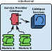

.. _robotkernel_service_provider:

Service Provider
================

A **Service Provider** is a dynamically loadable runtime component 
that exposes standardized **robotkernel services** to other modules 
and external interfaces. It acts as an abstraction layer between 
module-specific resources and the robotkernel core.

   **Figure:** Service Provider bridges module internals with the robotkernel service layer.

**Key characteristics:**

- Implemented as a dynamically loadable shared object (e.g., `.so` file).
- Exposes a minimal C interface to the robotkernel runtime.
- Converts module-specific functionality into standardized robotkernel services.
- Ensures decoupling between real-time control logic and non-cyclic communication layers.
- Automatically registers services when the hosting module reaches the operational phase.

.. note::
   A Service Provider bridges internal module functionality with the robotkernel service 
   layer — enabling unified, standardized access to non-cyclic or non-realtime data.

.. _robotkernel_service_provider_implementations:

Implementations and Use Cases
_____________________________

A wide range of Service Providers already exist within the **robotkernel** ecosystem, 
providing standardized, non-cyclic interfaces for communication with external tools, 
middleware, or diagnostic frameworks.

**Common Service Providers:**

- **CANopen**  
  Provides access to CANopen object dictionaries for configuration and diagnostics.

- **SERCOS**  
  Enables access to SERCOS service IDs for industrial drive control.

- **Memory/Process Data Inspection**  
  Offers introspection and debugging interfaces for real-time data monitoring.

- **Key-Value**  
  Lightweight service for configuration, parameter access, and runtime tuning.

- **File**  
  Supports file upload/download for firmware, logs, or configuration files.

**Typical use cases:**

- Export module data for visualization, remote monitoring, or control.
- Provide command and parameter channels via middleware (e.g., REST, CLI, ROS).
- Bridge slow control or diagnostic data into real-time execution domains.
- Centralize service access across distributed control networks.

.. note::
   Acts as a unified, modular, and extensible service layer for control, diagnostics, 
   and configuration — without modifying the core robotkernel.

.. _robotkernel_service_provider_lifecycle:

