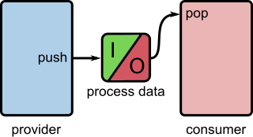
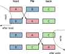

.. _process_data_device:

Process Data Devices
====================

Concept and Purpose
___________________

Process data devices are central components in the **robotkernel** system, 
representing shared data structures used for the **cyclic exchange of control 
and measurement data** between modules.

They serve as stable, deterministic data exchange points within the real-time 
control stack.

**Key characteristics:**

- Provide a consistent interface for exchanging sensor, actuator, and control data.
- Typically updated cyclically, synchronized via triggers.
- Decouple data producers (providers) from consumers (readers).
- Enable deterministic access to the latest valid system state.
- Support both hard and soft real-time control paths.

   **Figure:** Process data devices as cyclic data exchange points.

.. note::
   **Core idea:** Process data devices act as **stable, cyclic data exchange points** 
   inside robotkernel — ensuring consistency, determinism, and modularity.

.. _robotkernel_process_data_overview:

Overview
________

Process data devices are dynamically created and managed by **service providers** and 
accessed by **consumers** at runtime.

**Key principles:**

- **One writer, one or more readers** — clear ownership model.
- **Cyclic updates** — data is refreshed at defined intervals, typically triggered by a master module.
- **Non-blocking access** — consumers read the most recent valid snapshot without blocking producers.
- **Thread-safe** — designed for use across real-time and non-real-time threads.

**Naming convention**::

  <provider>.<path>.pd

**Examples:**
- `ethercat.slave_0.inputs.pd`
- `canopen.master_1.outputs.pd`
- `fsoe.safety.pd`

> ✅ **Note:** The `.pd` suffix identifies the device as a process data object.

.. note::
   **Key insight:** Process data reflects the **latest system state at the last completed cycle** — not a live stream.

.. _robotkernel_process_data_buffering:

Buffering Strategies
____________________

robotkernel supports multiple buffering models to meet different timing, safety, and performance requirements.

+--------------------+---------------------------------------------+---------------------------------+-----------------------------------+
| Strategy           | Use Case                                    | Pros                            | Cons                              |
+====================+=============================================+=================================+===================================+
| **Single Buffer**  | Non-critical diagnostics, low-latency paths | Minimal memory overhead         | Risk of inconsistent reads        |
+--------------------+---------------------------------------------+---------------------------------+-----------------------------------+
| **Triple Buffer**  | Real-time control, multi-threaded access    | Lock-free, consistent snapshots | Higher memory usage               |
+--------------------+---------------------------------------------+---------------------------------+-----------------------------------+
| **Pointer Buffer** | Large or variable-sized data, zero-copy     | No memory duplication           | Requires external synchronization |
+--------------------+---------------------------------------------+---------------------------------+-----------------------------------+

**Extensibility:** Additional buffering models can be integrated via a unified interface.

.. note::
   **Guideline:**
   
   Use **single buffer** for non-critical or non-cyclic data.
   
   Use **triple buffer** for cyclic control data shared across threads — ensures consistent, atomic access.

.. _robotkernel_process_data_triple_buffer:

Triple Buffer Mechanism
_______________________

The **triple buffer** pattern ensures **consistent, lock-free data exchange** between producer and consumer.

**Three buffers are maintained:**

- **Front** — currently readable snapshot (last valid data).
- **Back** — being written by the producer.
- **Flip** — holds the most recent data, waiting for the next atomic swap.

**How it works:**

1. The producer writes into the **back** buffer.
2. Upon completion, an **atomic pointer swap** promotes the **back** buffer to **front**, and the **flip** buffer becomes the new **back**.
3. Consumers always read from the **front** buffer — which is guaranteed to be fully valid.
4. No data races or intermediate states are visible.

   **Figure:** Atomic flip between back/front and flip buffers.

.. note::
   **Result:** Deterministic, lock-free data access — ideal for hard real-time systems.

.. _robotkernel_process_data_best_practices:

Best Practices
______________

**Recommended:**

- Keep process data definitions **stable and clearly typed** (e.g., using C structs).
- Treat updates as **atomic** — avoid partial writes.
- Synchronize provider timing using **triggers** or internal schedulers.
- Keep read operations **side-effect free** (no state changes).
- Use **triple or pointer buffers** for real-time deterministic access.

**Avoid:**

- Using process data for **asynchronous messaging** (use streams instead).
- Overloading process data with **state transitions** or **command logic**.
- Sharing writable references between multiple modules — violates single-writer rule.

.. note::
   **Design principle:** Process data is for **state sharing**, not control flow.

.. _robotkernel_process_data_use_case:

Typical Use Case
________________

A common scenario in robotkernel:

1. **PD Master** (e.g., `module_ethercat`) collects sensor data from EtherCAT slaves.
2. Data is written into a **triple-buffered process data device**.
3. Multiple modules read the data independently:
   - Real-time control loops
   - Logging and diagnostics
   - Middleware (e.g., ROS topic generators)
4. All modules are synchronized via a **trigger source** (e.g., `module_posix_timer`).

.. note::
   **Benefits:** Consistent, deterministic access across all modules — no race conditions.

.. _robotkernel_process_data_summary:

Summary
_______

- Process data devices are the **core mechanism** for cyclic, deterministic data exchange in robotkernel.
- They support **multiple buffering strategies** to balance performance, safety, and memory.
- The **triple buffer** pattern ensures **lock-free, consistent reads** — ideal for real-time control.
- Follow best practices to ensure **modularity, safety, and performance**.

For more details, see the `robotkernel` documentation at: `https://rmc-github.robotic.dlr.de/robotkernel <https://rmc-github.robotic.dlr.de/robotkernel>`_
