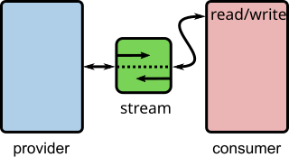
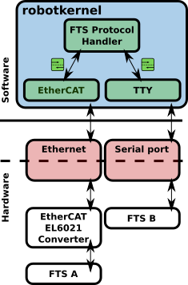

.. _data_stream_device:

Data Stream Device
==================

.. meta::
   :description: Abstracts character-oriented I/O (e.g., UART, TTY) behind a uniform interface in robotkernel.

.. _data_stream_concept:

Concept and Purpose
-------------------

A data stream device abstracts character-oriented I/O (e.g., TTY, UART, tunnelled links) behind a **uniform access layer**, enabling consistent handling of byte streams regardless of the underlying physical or logical transport.

### Key Benefits

- Simple `read()` and `write()` operations on a stream object — no low-level driver code required.
- Shields real device nodes (local or remote) behind a consistent interface.
- Centralizes configuration of the underlying hardware or communication endpoint.
- Suitable for any component that consumes or exposes byte streams (e.g., protocol handlers, debug consoles, serial bridges).

   *Architecture of the data stream device in robotkernel (simplified view).*

Naming Convention
~~~~~~~~~~~~~~~~~

Data stream devices are named using the pattern:

.. code-block:: yaml

   <provider>.<path>.stream

For example:

.. code-block:: yaml

   instance.tty.stream

This naming ensures hierarchical organization and enables discovery and configuration within the system.

.. _data_stream_integration:

Integration in Real Systems
---------------------------

A data stream can be backed by various types of endpoints:

- **Physical TTY devices**:  
  `/dev/ttyS0`, USB-to-serial adapters, CAN-UART bridges, etc.

- **Logical TTYs tunneled over industrial fieldbuses**:  
  For example, a UART interface exposed over EtherCAT or another real-time network.

### Advantages

- **Uniform API**: Handlers consume the same interface regardless of physical location.
- **Technology agnosticism**: Swap between local serial, networked, or fieldbus-tunneled links without changing application logic.
- **Decoupling**: Protocol handlers are decoupled from the underlying communication hardware.
- **Plug-and-play flexibility**: Enables seamless integration of new communication technologies.

   *Example: A single FTS module can connect to either a local serial port or an EtherCAT-tunneled UART without code changes.*

> **Example Use Case**:  
> The same FTS (Fieldbus Terminal Server) module can be deployed on a local embedded controller using a physical UART, or remotely via an EtherCAT-tunneled serial link — **with zero code changes**.

.. _data_stream_use_cases:

Use Cases and Constraints
-------------------------

### Common Use Cases

- Decoupling protocol handlers from physical communication hardware.
- Building console bridges to embedded controllers or remote systems.
- Implementing protocol translators (e.g., ASCII, line-based, binary encapsulation).
- Enabling remote diagnostics and firmware updates over heterogeneous networks.

### Design Constraints

- **No determinism guarantees**:  
  Not intended as a replacement for real-time process data (e.g., PDOs in CANopen or EtherCAT).
  
- **Unbounded data rate/length**:  
  Data streams may have variable or unpredictable throughput.  
  → Apply **external flow control** (e.g., buffering, backpressure) as needed.

- **Parsing outside critical sections**:  
  Avoid complex parsing or blocking operations in real-time contexts.  
  → Keep parsing logic in non-critical threads or event handlers.

.. note::
   Use data stream devices for **asynchronous, character-based communication**, not for time-critical or deterministic data exchange.
