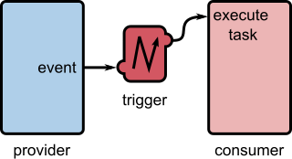
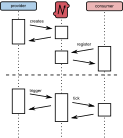

.. _trigger_device:

Trigger Device
==============

.. meta::
   :description: Overview of the trigger device concept in robotkernel for deterministic event-based execution.

.. _trigger_device_concept:

Concept and Purpose
-------------------

Triggers represent events or conditions within the system. Their primary role is to **synchronize execution paths in a deterministic manner**.

Typical use cases include:

- **Time-based triggers**  
  Fire at deterministic cyclic intervals (e.g., control loop at 1 kHz).

- **Data-driven triggers**  
  Activated when new telemetry data arrives or a buffer is updated.

- **State-condition triggers**  
  Fire when a logical or numeric condition becomes true (e.g., thresholds, limit violations, watchdogs, mode switches).

- **External event triggers**  
  Initiated by user interaction, remote commands, or signals from foreign subsystems.

- **Composite triggers**  
  Logical combinations of multiple triggers using AND/OR chaining.

   *Architecture of the trigger device in robotkernel (simplified view).*

Naming Convention
~~~~~~~~~~~~~~~~~

Triggers are named using the pattern:

.. code-block:: yaml

   <provider>.<path>.trigger

For example:

.. code-block:: yaml

   ecat.slave_0.inputs.trigger

This naming scheme ensures uniqueness and hierarchical organization within the system.

.. _trigger_device_execution:

Execution Flow
--------------

The trigger device operates through a well-defined lifecycle involving providers and consumers:

#. A **provider** creates a trigger device and registers it with the `robotkernel`.
#. One or more **consumers** look up the trigger device and subscribe to it.
#. When the trigger condition/event occurs, the **provider fires** the trigger.
#. The trigger device invokes the **tick routine** of all subscribed consumers.

   *Execution flow of trigger devices in robotkernel.*

Key Features and Notes
~~~~~~~~~~~~~~~~~~~~~~

- A provider may expose **one or many trigger devices**.
- A consumer may react to every *n*-th trigger (sub-sampling supported).
- **No polling required** — execution is fully event-driven and deterministic.
- Supports **low-latency, real-time synchronization** across components.

Use Case Example
~~~~~~~~~~~~~~~~

Imagine a real-time control loop running at 1 kHz:

- A time-based trigger is registered by the `timer` provider.
- The control algorithm (as a consumer) subscribes to this trigger.
- On each trigger fire, the control loop executes its tick routine.
- No CPU cycles wasted on polling — execution is precisely synchronized.

.. note::
   This model enables efficient, scalable, and predictable system behavior in robotics and embedded control applications.
